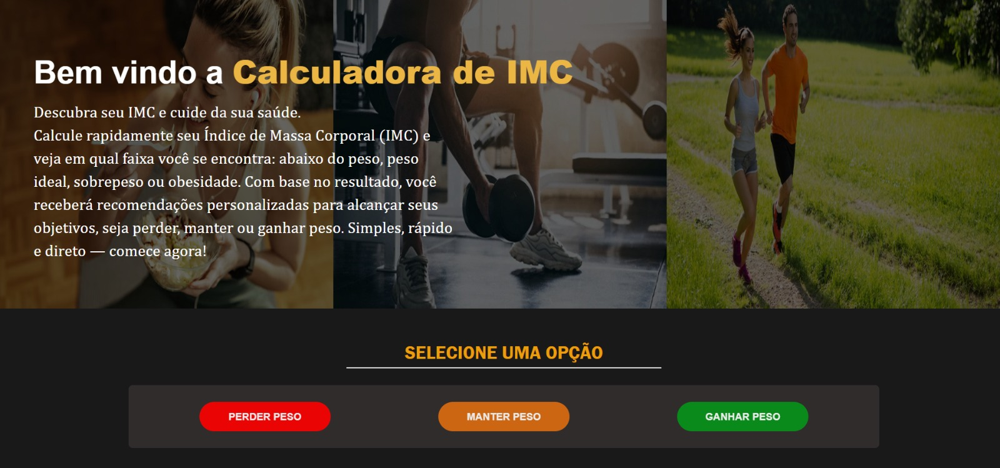
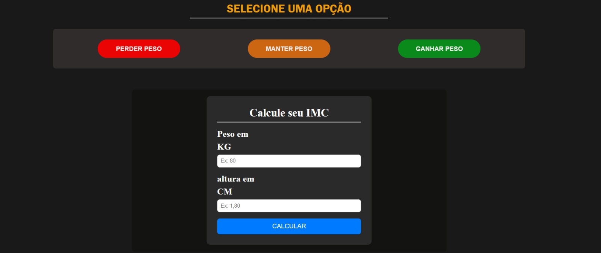
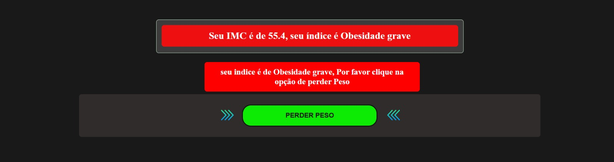
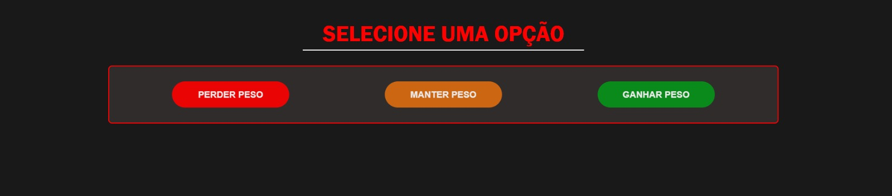

# 🧮 Calculadora de IMC Avançada

Este projeto é uma versão aprimorada de uma calculadora de IMC tradicional, com foco em oferecer não apenas o cálculo, mas também **orientações personalizadas de saúde e bem-estar** com base nos resultados do usuário.

## 🌍 Sobre o projeto

A aplicação calcula o IMC do usuário e, além da classificação padrão, analisa se o resultado está alinhado com a meta escolhida:

* Perder peso
* Manter peso
* Ganhar peso

Com base nisso, o sistema fornece **recomendações completas**, incluindo treino semanal e alimentação diária.

## 🚀 Funcionalidades

* Cálculo automático do IMC a partir do **peso** e **altura**
* Classificação do IMC (abaixo do peso, normal, sobrepeso, obesidade, etc.)
* Definição de metas personalizadas
* Verificação se o IMC está de acordo com a meta escolhida
* Sugestão de **treino semanal (segunda a domingo)**
* Sugestão de **alimentação diária completa**:

  * Café da manhã
  * Almoço
  * Lanche
  * Jantar
* Interface responsiva (mobile, tablet e desktop)

## 🛠️ Tecnologias utilizadas

* HTML5
* CSS3
* JavaScript

## 📂 Estrutura do projeto

```bash
/projeto
  ├── index.html
  ├── style.css
  ├── script.js
```

## ▶️ Como rodar o projeto

1. Clone este repositório:

```bash
git clone https://github.com/seuusuario/calculadora-imc-avancada.git
```

2. Acesse a pasta do projeto:

```bash
cd calculadora-imc-avancada
```

3. Abra o arquivo `index.html` no navegador

## 📸 Preview

### 🏠 Tela inicial



### 📊 Resultado do IMC


### ⚠️ Validação de erro


## 📌 Status do projeto

🚧 Em desenvolvimento — melhorias e novas funcionalidades serão adicionadas.

## 💡 Diferencial do projeto

Diferente de uma calculadora comum, este projeto busca entregar **valor real ao usuário**, oferecendo orientações práticas com base no resultado do IMC, simulando uma experiência mais próxima de aplicações reais de saúde.

## ⚠️ Aviso

As recomendações de treino e alimentação são apenas para fins educativos e não substituem orientação profissional.

---

Feito por Gabriel 🚀
