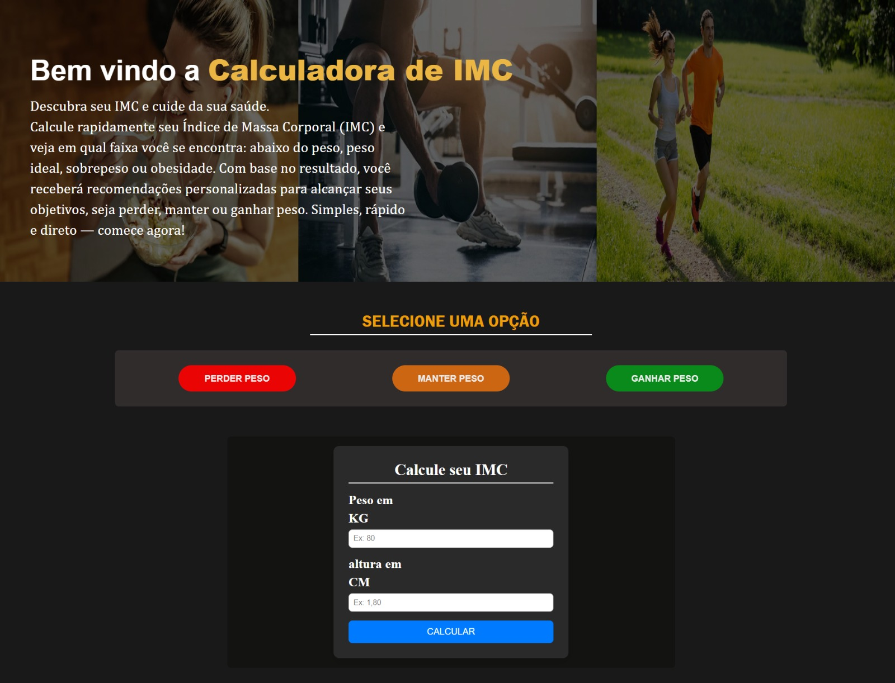
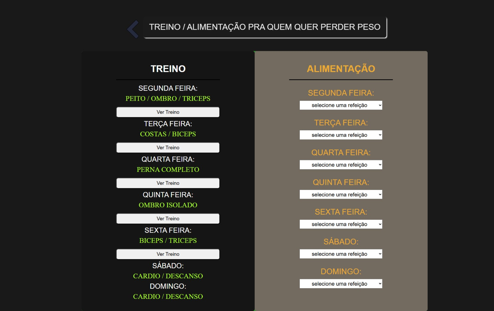
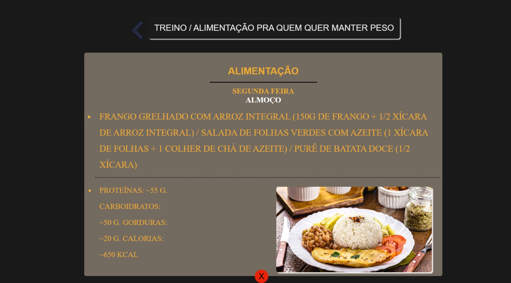

# 🧮 Calculadora de IMC Avançada


Uma aplicação web que vai além do cálculo de IMC, oferecendo **recomendações personalizadas de saúde e bem-estar** com base no objetivo do usuário.

---

## 🌍 Sobre o projeto

Esta aplicação calcula o IMC e analisa se o resultado está alinhado com a meta escolhida:

- Perder peso  
- Manter peso  
- Ganhar peso  

Com base nisso, o sistema gera **orientações práticas**, simulando uma experiência mais próxima de aplicações reais de saúde.

---

## 🖼️ Preview

<div align="center">
  
  
</div>

<div align="center">
  
  
</div>


---

## 🚀 Funcionalidades

✔️ Cálculo automático do IMC  
✔️ Classificação completa (abaixo do peso, normal, sobrepeso, etc.)  
✔️ Definição de metas personalizadas  
✔️ Análise inteligente baseada na meta escolhida  
✔️ Sugestão de treino semanal (segunda a domingo)  
✔️ Sugestão de alimentação diária:  

- Café da manhã  
- Almoço  
- Lanche  
- Jantar  

✔️ Interface totalmente responsiva  

---

## 🛠️ Tecnologias utilizadas

- HTML5  
- CSS3  
- JavaScript  

---

## ▶️ Como rodar o projeto

```bash
# Clone o repositório
git clone https://github.com/gabrieldev25789/calculadora-imc-avancada.git

# Acesse a pasta
cd calculadora-imc-avancada

# Abra no navegador
index.html
```